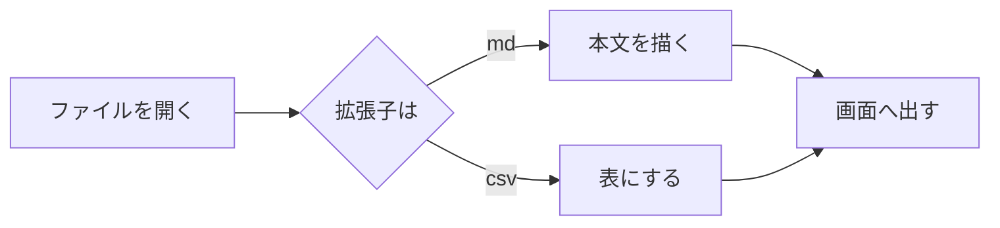
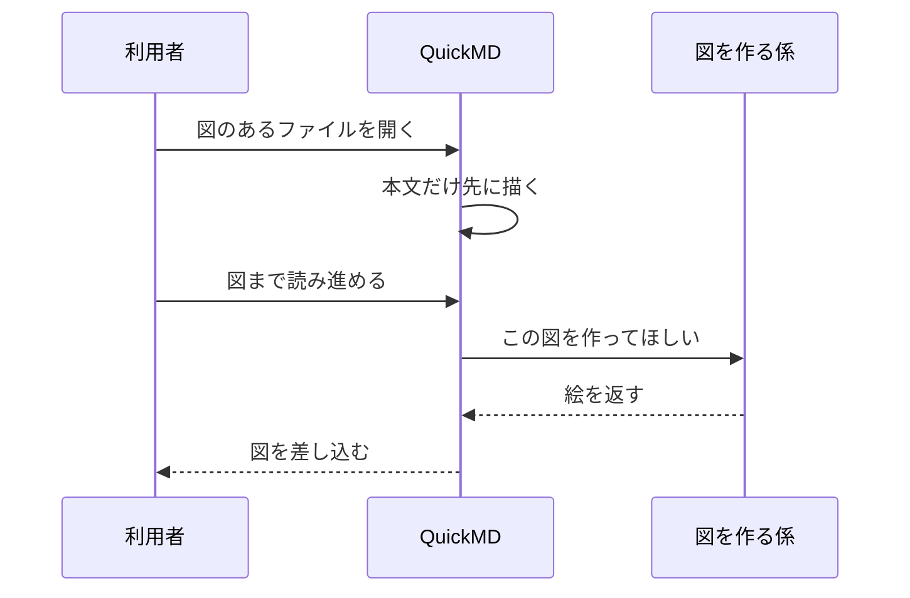
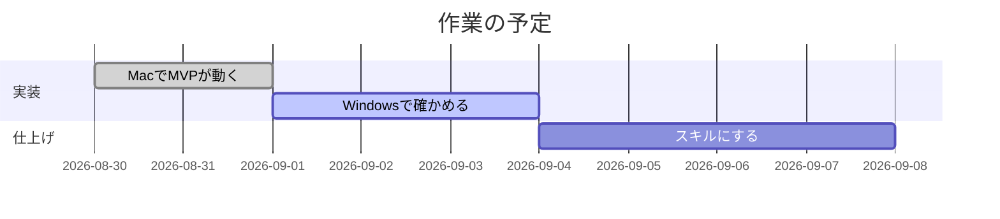

# 全部入りの見本

マークダウン（GitHub Flavored Markdown）に出てくる書き方を、ひととおり並べたファイルです。
表示の崩れを見つけるために使います。上から順に見ていってください。

---

## 1. 見出し

# 見出し1
## 見出し2
### 見出し3
#### 見出し4
##### 見出し5
###### 見出し6

下線で書く見出し
===============

下線で書く見出し2
---------------

## 2. 段落と改行

これはひとつの段落です。改行を1つ入れただけでは、
同じ段落のまま続きます。

空行を挟むと、新しい段落になります。

行末に空白を2つ置くと、  
そこで改行されます。

逆斜線を置いても、\
そこで改行されます。

## 3. 強調

*斜体* と _斜体_ が並びます。**太字** と __太字__ も並びます。
***太字の斜体*** と ~~打ち消し~~ もあります。

語の**中**に強調を入れると、日本語では効かないことがあります。

## 4. 箇条書き

- ひとつめ
- ふたつめ
  - 入れ子
  - 入れ子
    - さらに入れ子
- みっつめ

* 記号を変えても同じです
+ これも同じです

1. 番号つき
2. ふたつめ
3. みっつめ
   1. 入れ子の番号
   2. ふたつめ

7. 途中の数から始める
8. 続き

間を空けた箇条書き（ゆるい書き方）です。

- ひとつめの項目

- ふたつめの項目

- みっつめの項目

## 5. 作業の一覧

- [x] 終わった作業
- [ ] これからの作業
  - [x] 入れ子の終わった作業
  - [ ] 入れ子のこれからの作業

## 6. 引用

> 引用です。
> 続きの行も同じ引用に入ります。
>
> > 入れ子の引用です。
>
> - 引用の中の箇条書き
> - ふたつめ

引用の中に見出しも置けます。

> ### 引用の中の見出し
>
> 本文です。

## 7. 区切り線

---

***

___

## 8. コード

`インラインのコード` を文の中に置きます。``バッククォートを含む `コード` `` も書けます。

字下げによるコードです。

    これは4つの空白で字下げしたコードです。
    そのままの形で出ます。

言語を指定したコードです。

```rust
fn main() {
    // 速さは、削った分だけ手に入る
    let files: Vec<&str> = vec!["a.md", "b.csv"];
    for f in &files {
        println!("開く: {f}");
    }
}
```

```python
def 起動時間(回数: int) -> float:
    """何度か測って、真ん中の値を返す。"""
    values = [measure() for _ in range(回数)]
    return sorted(values)[len(values) // 2]
```

```json
{
  "theme": "light",
  "font_size": 16,
  "enable_math": true
}
```

言語を指定しないコードです。

```
色は付けず、そのままの文字で出します。
```

波線でも囲めます。

~~~
波線で囲んだコードです。
~~~

長い行を含むコードです。枠の中だけが横に流れます。

```bash
cargo build --release --target x86_64-pc-windows-msvc --manifest-path native/Cargo.toml --verbose --offline
```

## 9. 表

| 項目 | 値 | 単位 |
|---|---:|:---:|
| 起動 | 220 | ミリ秒 |
| 実行ファイル | 11.9 | MB |
| 対応する拡張子 | 12 | 種類 |

列の寄せを変えた表です。

| 左寄せ | 中央 | 右寄せ |
|:---|:---:|---:|
| あ | い | う |
| かきくけこ | さしすせそ | たちつてと |

横に長い表です。本文の幅を超えたら、表だけが横に流れます。

| 名前 | 所属 | 役割 | 連絡先 | 備考 | 開始日 | 終了日 | 状態 | 担当者 | 優先度 |
|---|---|---|---|---|---|---|---|---|---|
| 佐藤 | 開発 | 設計と実装 | sato@example.com | 立ち上げから参加 | 2026-08-30 | 未定 | 進行中 | 本人 | 高 |
| 鈴木 | 営業 | 顧客との調整 | suzuki@example.com | 週2日 | 2026-09-01 | 2026-12-31 | 未着手 | 佐藤 | 中 |

表の中に**強調**や`コード`、[リンク](https://example.com) も置けます。

| 書き方 | 見え方 |
|---|---|
| `**太字**` | **太字** |
| `~~打ち消し~~` | ~~打ち消し~~ |

## 10. リンク

そのまま書くリンクは [Rust の公式](https://www.rust-lang.org/) です。
題名つきは [egui](https://github.com/emilk/egui "GPU へ直に描く GUI") です。

参照で書くリンクは [Tauri][tauri] です。

[tauri]: https://v2.tauri.app/ "Tauri の公式"

まとめて書く形は [Mermaid][] です。

[Mermaid]: https://mermaid.js.org/

省いて書く形は [Wikipedia] です。

[Wikipedia]: https://ja.wikipedia.org/

山かっこで囲むと、そのまま行き先になります: <https://example.com/> と <someone@example.com>。

そのまま書いた https://example.com/plain も行き先になります。

同じフォルダのファイルへのリンクは [数式と図の見本](./math-and-diagrams.md) と
[CSV の見本](./table.csv) です。押すと新しいウィンドウで開きます。

同じ文書の中へ飛ぶリンクは [10. リンク](#10-リンク) です。

画像を包んだリンクです。

[](https://www.rust-lang.org/)

## 11. 画像

1行に置いた画像です。右クリックで保存できます。


題名つきの画像です。


文の途中に置いた画像  は、文の一部として出ます。

見つからない画像です。


## 12. 動画と音

1行に置いた動画です。ひとコマがサムネとして出て、押すと再生の窓が開きます。


## 13. 数式

インラインの数式は $E = mc^2$ です。円の面積は $S = \pi r^2$、
和の記号は $\sum_{i=1}^{n} i = \frac{n(n+1)}{2}$ です。

金額の $100 と $200 は数式として扱いません。

ブロックの数式です。

$$
\int_{-\infty}^{\infty} e^{-x^2}\,dx = \sqrt{\pi}
$$

$$
\begin{aligned}
f(x) &= a x^2 + b x + c \\
f'(x) &= 2 a x + b
\end{aligned}
$$

行列も書けます。

$$
A = \begin{pmatrix}
1 & 2 & 3 \\
4 & 5 & 6 \\
7 & 8 & 9
\end{pmatrix}
$$

## 14. Mermaid の図







## 15. 脚注

本文に脚注を置きます[^1]。2つめの脚注も置きます[^長い名前]。

[^1]: 脚注の中身はここに出ます。
[^長い名前]: 名前は数字でなくてもかまいません。

## 16. 逆斜線と実体参照

逆斜線で打ち消すと \*斜体になりません\* と \`コードになりません\` と書けます。

実体参照は &amp; &lt; &gt; &quot; &copy; &hellip; &#169; &#x1F600; です。

## 17. 生の HTML

<p align="center">中央に寄せた段落です。</p>

<details>
<summary>折りたたみ（押すと開きます）</summary>

中に本文を置けます。**強調**も効きます。

</details>

<kbd>Ctrl</kbd> + <kbd>,</kbd> のような表記もあります。

<video src="./sample.mp4" controls width="480"></video>


## 18. 定義の並び

用語
: その説明です。

もうひとつの用語
: こちらの説明です。

## 19. 上つき文字と下つき文字

水は H~2~O、面積は 10^2^ と書けます。

## 20. 注意書き

> [!NOTE]
> 知っておくと役に立つことです。

> [!TIP]
> うまくやるための助言です。

> [!IMPORTANT]
> 見落とすと困ることです。

> [!WARNING]
> 気をつけるべきことです。

> [!CAUTION]
> 危ないことです。

## 21. 長い行

折り返しの設定を切ると、この行は右へ流れます。設定で「右端で折り返す」を切ってから、この行がどこまで伸びるかを確かめてください。折り返す設定のままなら、本文の幅で折り返されます。日本語の長い文章でも同じように振る舞うかを見ます。

## 22. 空の要素

空の箇条書きです。

-
-

空のコードです。

```
```

以上です。
