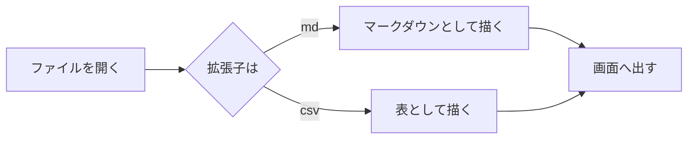
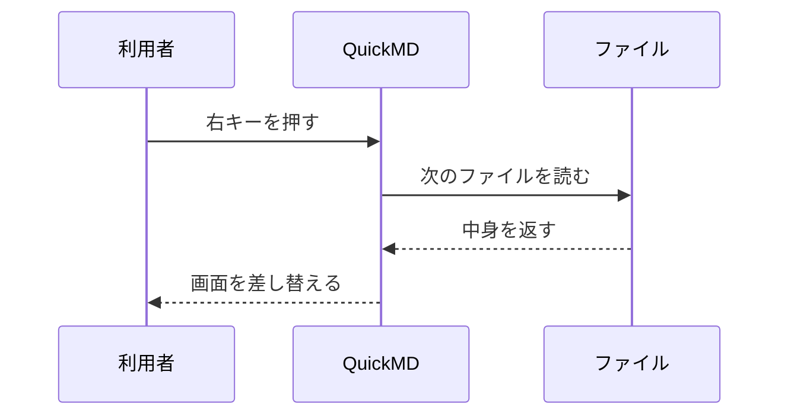

# 数式と Mermaid

## インラインの数式

質量とエネルギーの関係は $E = mc^2$ で表されます。
円の面積は $S = \pi r^2$、和の記号は $\sum_{i=1}^{n} i = \frac{n(n+1)}{2}$ です。
金額の $100 と $200 は数式として扱いません。

## ブロックの数式

$$
\int_{-\infty}^{\infty} e^{-x^2}\,dx = \sqrt{\pi}
$$

$$
\begin{aligned}
f(x) &= a x^2 + b x + c \\
f'(x) &= 2 a x + b
\end{aligned}
$$

## Mermaid のフローチャート



## Mermaid の順序図



## コードの中のドル記号

```bash
echo "$HOME の中の $PATH は数式ではありません"
```

インラインでも `$x + y$` はそのまま出ます。
